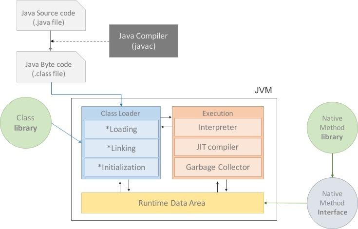

# SM 2주차  

  

### 목표

---

* 자바 소스 파일(*.java)을 JVM으로 실행하는 과정 이해  

  

### 목차

---

1. JVM이란?
2. 컴파일 하는 방법
3. 실행하는 방법
4. 바이트코드란?
5. JIT컴파일러란? / 동작과정
6. JVM 구성요소
7. JDK / JRE 차이  

  

### JVM 이란?

* 스택 기반 자바 가상머신

  >  가상머신: 프로그램을 실행하기 위해서 물리적으로 유사한 머신을 소프트웨어로 구현한 것

* Java 와 OS 사이에서 중개자 역할을 하며, Java가 OS에 구애받지 않고 사용가능하도록 함. (WORA)

* 메모리 관리, Garbage Collection 수행  

  

### 컴파일 하는 방법

* 전통적인 컴파일은 어떤 언어로 된 소스코드를 기계가 인실할 수 있는 네이티브 코드로 변환하는 과정을 의미

* 자바에서의 컴파일은 자바 언어로 된 코드를 JVM이 인식할 수 있는 명령어코드(바이트코드)로 변환하는 것을 의미

* JDK를 설치하면 javac라는 자바 컴파일러가 포함되어있다.

* 자바 소스 파일(.java) -> javac 컴파일러 -> JVM 바이트코드(.class)

  ```
  javac 파일명.java
  ```

  

### 실행 하는 방법

* java 명령어를 사용해서 파일 실행

  ```
  java 파일명.java
  ```

> 자바프로그램 실행과정
>
> 1. 프로그램이 실행되면 JVM은 OS로부터 필요한 메모리를 할당받는다.
> 2. 자바 컴파일러(javac)가 자바 소스코드(.java)를 읽어 자바 바이트코드(.class)로 변환한다.
> 3. Class Loader를 통해 class파일들을 JVM으로 로딩한다.
> 4. 로딩된 class 파일들은 Execution engine을 통해 해석된다.
> 5. 해석된 바이트코드는 Runtime Data Areas에 배치되어 실질적으로 수행된다.  

   

### 바이트 코드란?

* 가상머신이 이해하는 언어로 변환된 자바 소스코드
* 코드의 명령어 크기가 1바이트라서 바이트코드라고 부름
* 확장자: .class
* 자바 가상머신이 설치되어 있으면 어떤 운영체제에서도 실행 가능하다.  

   

### JIT 컴파일러란 무엇이고 어떻게 작동하는지

1. 무엇인가?
   * Just In Time
   * 바이트코드를 컴퓨터 프로세서(CPU)로 직접 보낼 수 있는 명령어로 바꾸는 프로그램
   * 프로그램 실행 중에 (run time 중에) 가상 기계 상에서만 돌아가는 자바 바이트 코드를 해당 플랫폼에 맞는 기계어로 컴파일해주는 특수한 컴파일러.
   * 실행에 비교적 많은 시간이 걸리는 바이트코드를 JIT컴파일러로 컴파일 함으로써 실행속도를 향상시킨다.

2. 어떻게 작동하는가?
   * 프로그램이 실행되면 JRE안에 존재하면서 프로그램을 실행할 때 기계어로 번역해 전달한다.
   * 같은 코드를 매번 해석하지 않고 실핼할  때 컴파일을 하면서 해당코드를 캐싱
   * 바뀐 부분만 컴파일 하고 나머지는 캐싱된 코드를 사용해서 인터프리터의 속도를 개선할 수 있다.  

  

### JVM 구성요소



 1. **Class Loader** (클래스로더)

    * JVM내로 .class 파일을 로드하고 링크를 통해 배치하는 작업을 수행하는 모듈.
    * Runtime 시에 동적으로 클래스(.class)를 로드한다.
    * jar 파일 내에 저장된 클래스를 JVM 위에 탑재하고 사용하지 않는 클래스들은 메모리에서 삭제한다.  

      

	2. **Execution Engine** (실행 엔진)

    * 클래스를 실행시키는 역할.

    * **Class Loader**가 JVM내의 런타임 데이터 영역에 바이트코드를 배치시키고 실행엔진에 의해 실행된다.

    * **Execution Engine**은 바이트코드를 실제로 JVM내부에서 기계가 실행할 수 있는 형태로 변경한다.

      * Interpreter (인터프리터)

        * **Excution Engine**은 바이트코드를 명령어 단위로 읽어서 실행한다.
        * 이 방식은 인터프리터 언어의 단점을 그대로 갖고있다. -> 느림

      * JIT (Just - In - Time)

        * 인터프리터 방식의 단점을 보완하기위해 도입
        * JIT 컴파일러가 컴파일하는 과정은 바이트코드를 인터프리팅 하는 것 보다 오래걸리므로 한번만 실행되는 코드는 컴파일하지 않고 인터프리팅하는 것이 유리하다.
        * JIT 컴파일러를 사용하는 JVM들은 내부적으로 해당 메서드가 얼마나 자주 수행되는지 체크하고 일정 정도를 넘을 때에만 컴파일을 수행한다.

      * GC (Garbage Collector)

        * GC를 수행하는 모듈(쓰레드)이 있다.  

          

	3. **Runtime Data Area**

    

    

     * 프로그램을 수행하기 위해서 OS에서 할당받은 메모리 공간

     * **PC Register**

       	* Thread가 시작될 때 생성되며 스레드마다 하나씩 존재한다.
          	* Thread가 어떤 부분을 어떤 명령으로 실행해야할지를 기록하는 부분
       	* 현재 수행 중인 JVM 명령의 주소를 갖는다.

    * **JVM 스택 영역**

      * 프로그램 실행과정에서 임시로 할당되었다가 메소드를 빠져나가면 바로 소멸되는 데이터를 저장하기 위한 영역
      * 변수, 임시데이터, 스레드나 메소드의 정보를 저장한다.
      * 메소드 호출 시 마다 각각의 스택 프레임이 생성된다.
      * 지역변수를 저장하나
      * 메소드 수행이 끝나면 프레임 별로 삭제한다.

    * **Native Method Stack**

      * 기계어로 작성된 프로그램을 실행시키는 영역

    * **Method Area **(class area, static area)

      * 클래스 정보를 처음 메모리에 적재할 때 초기화 되는 대상을 저장하기 위한 메모리 공간.

      * 적재되는 정보

        * Field Information

          > 멤버변수의 이름, 데이터 타입, 접근제어자에 대한 정보

        * Method Information

          > 메소드의 이름, 리턴타입, 매개변수, 접근제어자에 대한 정보

        * Type Information

          > class 인지 Interface인지 여부 저장

      * Method Area는 클래스 데이터를 위한 공간

      * GC의 관리 대상

    * **Heap** (힙 영역)

      * 객체를 저장하는 가상 메모르 공간이다.
      * **new** 연산자로 생성된 객체와 배열을 저장한다.
      * class area 에 올라온 클래스들만 객체로 생성할 수 있다.

      

​    

### JDK와 JRE의 차이

1. **JDK** (Java Development Kit) [[참고]](https://ko.wikipedia.org/wiki/%EC%9E%90%EB%B0%94_%EA%B0%9C%EB%B0%9C_%ED%82%A4%ED%8A%B8)

   * Java 환경에서 돌아가는 프로그램을 개발하는 데 필요한 툴들을 모아놓은 소프트웨어 패키지

   * Java 프로그래밍을 하기 위해서는 JDK를 설치해야 한다.

     > javac.exe : 컴파일러 = .java -> .class로 변환
     >
     > java.exe : 인터프리터 = 바이트코드 해석, 실행
     >
     > javap.exe : 역어셈블러 = .class -> .java
     >
     > jar.exe : 압축프로그램 = 클래스파일과 프로그램의 실행에 관련된 파일을 jar파일로 압축 & 해제
     >
     > JRE 

2. **JRE** (Java Runtime Environment)

   * class 파일을 JVM으로 로딩시키는 역할을 한다.
   * Java 프로그램을 개발하지 않고 실행만 한다면 JDK없이 JRE만 있으면 된다.
   * JVM + Java 패키지 클래스 + 런타임 라이브러리  

  

---

>Run Time : 컴파일된 응용프로그램이 사용자에 의해 실행되는 때(time).
>
>Run Time Error : 프로그램이 실행 중이지만, 의도치 않은 예외 상황으로 인하여 프로그램 중 발생하는 오류
>
>Compile Time : 프로그래밍 언어로 작성된 소스코드가 컴파일 과정을 통해 기계어로 변환되어 실행가능한 프로그램이 되어가는 과정
>
>Compile Time Error : 컴파일 되는 과정에서 발생되는 Systax error, 파일 참조 오류 등으로 발생되는 오류.