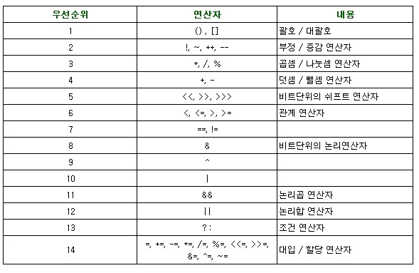

# SM 4주차

​	

### 목표

---

* 자바가 제공하는 다양한 연산자 학습


### 목차

---

1. 산술 연산자
2. 비트 연산자
3. 관계 연산자
4. 논리 연산자
5. instance of
6. assignment(=) operator
7. 3항 연산자
8. 연산자 우선순위


### 1. 산술 연산자

---

#### 이항 연산자

* 덧셈, 뺄셈, 곱셈, 나눗셈, 나머지

  ```java
  int a = 10, b = 20;
  
  System.out.println(a + b);	//	30
  System.out.println(a - b);	//	-10
  System.out.println(a * b);	//	200
  System.out.println(a / b);	//	0
  System.out.println(a % b);	//	10
  ```

* \+ 연산자는 문자열을 연결하는데에도 사용된다

  ```java
  String s1 = "hello";
  String s2 = "world";
  
  System.out.println(s1 + " " + s1);
  // hello world
  ```

* 0으로 나누면 ArithmeticException 발생


#### 단항 연산자

| +    | 양수를 표현한다. (실제로 사용 x)                    |
| ---- | --------------------------------------------------- |
| -    | 음수를 표현                                         |
| ++   | 증가(increment) 연산자로 항의 값을 1씩 증가 시킨다. |
| --   | 감소(decrement) 연산자로 항의 값을 1씩 감소 시킨다. |

```java
int a = 1;
System.out.println("i: " + i++);	// i: 1
System.out.println("i: " + i);		// i: 2
System.out.println("i: " + ++i);	// i: 3
System.out.println("i: " + i);		// i: 3
```


### 2. 비트 연산자

---

#### 비트 이동 연산자

| 연산자 |                             설명                             |
| :----: | :----------------------------------------------------------: |
|  x<<y  | 정수 x 의 각 비트를 y 만큼 왼쪽으로 이동시킨다. (빈칸은 0으로) |
|  x>>y  | 정수 x 의 각 비트를 y 만큼 오른쪽으로 이동시킨다. (빈칸은 정수 x의 최상위 부호 비트와 같은 값으로) |
| x>>>y  | 정수 x 의 각 비트를 y 만큼 오른쪽으로 이동시킨다. (빈칸은 0으로) |

```java
System.out.println(2 << 3);			// 0 0010 -> 1 0000 : 16
System.out.println(16 >> 3);		// 1 0000 -> 0 0010 : 2
System.out.println(-16 >> 3);		// 11111111 11111111 11111111 11110000
														// ->  11111111 11111111 11111111 11111110 000
System.out.println(-16 >>> 3)		// 11111111 11111111 11111111 11110000
  													// ->  00011111 11111111 11111111 11111110 000 :536870910
```

#### 비트 논리 연산자

| 연산자 |                   설명                    |
| :----: | :---------------------------------------: |
|   &    |           AND (둘 다 1이어야 1)           |
|   \|   |          OR (하나라도 1 이면 1)           |
|   ^    | XOR (두 비트가 (1, 0) \|\| (0, 1) 이면 1) |
|   ~    |                NOT (반전)                 |


### 3. 관계 연산자

---

* 두 항의 관계를 boolean 타입으로 return.
* 기본형 타입에서 연산이 가능하다

| 연산자 |                   설명                    |
| :----: | :---------------------------------------: |
|   >    |      왼쪽이 크면 true, 아니면 false       |
|   <    |     오른쪽이 크면 ture, 아니면 false      |
|   >=   |  왼쪽이 크거나 같으면 true, 아니면 false  |
|   <=   | 오른쪽이 크거나 같으면 true, 아니면 false |
|   ==   |     두 항이 같으면 true, 아니면 false     |
|   !=   |     두 항이 다르면 true, 아니면 false     |

* 참조형 변수는 두 변수의 주소값을 비교

* ```equals``` 메소드 사용하여 비교

  ```java
  String s1 = "hello";
  String s2 = "world";
  String s3 = "hello";
  
  System.out.println(s1.equals(s2));	// false
  System.out.println(s1.equals(s3));	// true;
  System.out.println(s1 == s3);				// false;
  ```

  

### 4. 논리연산자

---

* 두 항을 논리 연산 해서 ture 또는 false 반환
* **!** 연산자를 제외하고 모두 이항 연산자이다.

| 연산자 |                    설명                     |
| :----: | :-----------------------------------------: |
|   &&   |         두 항이 모두 true 이면 true         |
|  \|\|  | 두 항 중에 적어도 하나의 항이 true이면 true |
|   !    |        true면 false // false면 true         |


### 5. instance of

* 객체 타입을 확인하는데 사용한다.
* 형변환이 가능한지 true 또는 false로 알려준다.

```java
public class Instanceof{
  public static void main(String[] args){
    A a = new A();
    B b = new B();
    if(a instanceof Object)
	    System.out.println("오브젝트 클래스로 형변환");	// 출력
    if(b instanceof A)
      System.out.println("부모 클래스로 형변환");		// 출력
    if(a instanceof A)
      System.out.println("본인 클래스로 형변환");		// 출력
    if(a instanceof B)
      System.out.println("자식 클래스로 형변환");		// 출력 안됨.
  }
}
class A{}
class B extends A{}
```


### 6. assignment(=) operator (대입 연산자)

---

* 변수에 값을 대입할 때 사용하는 이항연산자

| 대입 연산자 |                             설명                             |
| :---------: | :----------------------------------------------------------: |
|      =      |        왼쪽의 피연산자에 오른쪽의 피연산자를 대입함.         |
|     +=      | 왼쪽의 피연산자에 오른쪽 피연산자를 **더한** 후 왼쪽의 피연산자에 대입함. |
|     -=      | 왼쪽의 피연산자에 오른쪽 피연산자를 **뺀** 후 왼쪽의 피연산자에 대입함. |
|     *=      | 왼쪽의 피연산자에 오른쪽 피연산자를 **곱한** 후 왼쪽의 피연산자에 대입함. |
|     /=      | 왼쪽의 피연산자에 오른쪽 피연산자를 **나눈** 후 왼쪽의 피연산자에 대입함. |
|     %=      | 왼쪽의 피연산자에 오른쪽 피연산자를 **나눈 후 나머지**를 왼쪽의 피연산자에 대입함. |
|     &=      | 왼쪽의 피연산자에 오른쪽 피연산자를 **비트 AND 연산** 후 왼쪽의 피연산자에 대입함. |
|     \|=     | 왼쪽의 피연산자에 오른쪽 피연산자를 **비트 OR 연산** 후 왼쪽의 피연산자에 대입함. |
|     ^=      | 왼쪽의 피연산자에 오른쪽 피연산자를 **비트 XOR 연산** 후 왼쪽의 피연산자에 대입함. |
|     <<=     | 왼쪽의 피연산자에 오른쪽 피연산자를 **왼쪽 비트 이동** 후 왼쪽의 피연산자에 대입함. |
|     >>=     | 왼쪽의 피연산자에 오른쪽 피연산자를 **부호를 유지하며 오른쪽 비트 이동** 후 왼쪽의 피연산자에 대입함. |
|    >>>=     | 왼쪽의 피연산자에 오른쪽 피연산자를 **부호 상관없이 오른쪽 비트 이동** 후 왼쪽의 피연산자에 대입함. |


### 7. 3항 연산자

---

* 3항 연산자는 피연산자가 3개인 연산자 **if문**을 간결하게 만들 수 있다.

```java
int a = true;
String b = a ? "true" : "false";
System.out.println(b);	//	true
```


### 8. 연산자 우선순위

---

