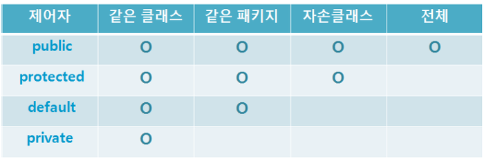

# SM 7주차

​		

### 목표

---

* 자바의 class


### 목차

---

1. 클래스 정의하는 방법
2. 객체 만드는 방법 (new 키워드 이해)
3. 메소드 정의하는 방법
4. 생성자 정의하는 방법
5. this 키워드 이해하기


#### 1. 클래스 정의하는 방법

---

* 클래스란?

  * 변수와 메서드를 가지고 있는 집합
  * 객체 생성을 위한 틀
  * class 키워드로 정의하고, new 연산자를 통해 인스턴스를 생성한다.

  

  밑의 코드는 Student  클래스를 정의한 것이다.

  ```java
  public class Student {
      int id;
      String studentNumber;
      String name;
      int year;
      String departmentName;
  
    	public Student(int id, String name, ...){
        ...
        // 생성자
      }
    
      public int getId() {
          return id;
      }
  
      public void setId(int id) {
          this.id = id;
      }
  
      public String getStudentNumber() {
          return studentNumber;
      }
  
      public void setStudentNumber(String studentNumber) {
          this.studentNumber = studentNumber;
      }
  
      public String getName() {
          return name;
      }
  
      public void setName(String name) {
          this.name = name;
      }
  
      public int getYear() {
          return year;
      }
  
      public void setYear(int year) {
          this.year = year;
      }
  
      public String getDepartmentName() {
          return departmentName;
      }
  
      public void setDepartmentName(String departmentName) {
          this.departmentName = departmentName;
      }
  }
  ```


* 클래스 멤버 구성

  * 객체의 초기화를 담당하는 생성자
  * 클래스가 가지는 속성을 정의하는 멤버변수
  * 클래스가 가지는 데이터를 조작하는 메소드

  


#### 2. 객체 만드는 방법 (new 키워드 이해)

---

```java
public class Test{
  public static void main(String[] args){
    Student dongyeol = new Student(25, "윤동열", ...);
  }
}
```


* 객체(인스턴스)를 생성할 때 사용하는 코드이고 변수가 실제 데이터가 아닌 참조값을 갖는다.

* **new** 키워드는 클래스 타입의 인스턴스를 생성해주는 역할을 담당한다.

* **new** 연산자를 통해 메모리(heap 영역)에 데이터를 저장할 공간을 할당받고 그 공간의 참조값을 객체에 반환하고 이어서 생성자를 호출한다.

  | 클래스 |  객체변수   |  =   |                  <u>**new**</u>                  |  클래스();  |
  | :----: | :---------: | :--: | :----------------------------------------------: | :---------: |
  | 자료형 | 참조값 저장 |      | 메모리 할당<br /> 인스턴스 생성<br />참조값 리턴 | 생성자 호출 |

  


#### 3. 메소드 정의하는 방법

---



```java
public int getId() {
  return id;
}

public int setId(int id){
  this.id = id;
}
```

메소드는 접근 지정자, 리턴타입, 메소드 이름, 매개변수, 메소드의 body 부분으로 이루어져 있다.


#### 4. 생성자 정의하는 방법

---

* 생성자는 new 연산자를 통해 객체가 생성될 때 반드시 호출되고 제일먼저 실행되는 일종의 메소드

  > 메소드와 비슷하지만 메소드는 아니다.

* 생성자는 멤버변수를 초기화한다. (객체를 초기화)

* 생성자는 리턴값이 없다.

  ```java
  class Student{
    String name;
    int id;
    ...
      
    // 생성자
    public Student(String name, int id, ...){
      this.name = name;
      this.id = id;
      ...
    }
    
  }
  ```

* 생성자가 정의되어있지 않으면 기본생성자가 실행된다. (생략 가능)

  ```java
  public Student() { }
  ```

  


#### 5. this 키워드 이해하기

---

* this  키워드는 인스턴스 자기 자신을 의미한다.

* this. 은 주로 전역변수와 메소드 또는 생성자의 매개변수의 이름이 동일할 때 인스턴스 필드임을 명시.

  ```java
  public void setId(int id){
    this id = id;
  }
  ```


* **this()**

  * 자기 자신의 생성자를 호출할 때 사용하는 키워드
  * 생성자가 다양해질 때 (오버로딩) this()를 이용하면 중복된 코드를 간단하게 작성할 수 있다.

  ```java
  public class Student{
    String name;
    int id;
  	int year;
    
    public Student(String name){
      this(name, null, null);
    }
    
    public Student(String name, int id){
      this(name, id, null);
    }
    
    public Student(String name, int id, int year){
      this.name = name;
      this.id = id;
      thid.year = year;
    }
    
    ...
      
  }
  ```

  