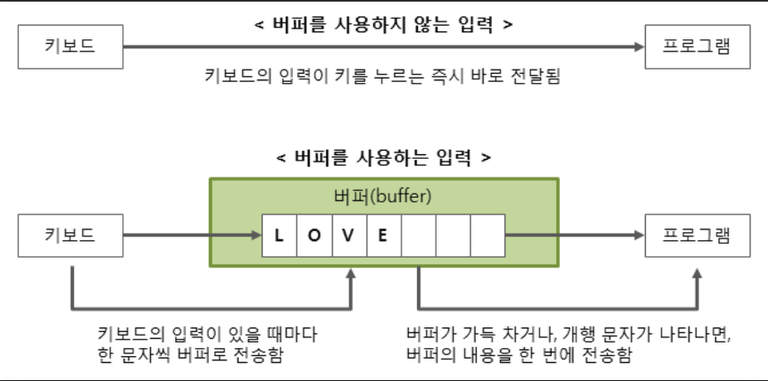

# Java 입출력


### BufferedReader / BufferedWriter

* 버퍼를 이용하여 읽고 쓰기 때문에 입출력의 효율이 좋아짐



* 하드디스크의 속도가 엄청 느리기 때문에 데이터를 버퍼에 묶어서 이동시키는 것이 입출력 시 마다 이동시키는 것보다 훨씬 빠르다.

```java
import java.io.BufferedReader;
import java.io.BufferedWriter;
import java.io.IOException;
import java.io.InputStreamReader;
import java.io.OutputStreamWriter;

// bufferedReader, bufferedWriter를 이용한 입출력

public class Main {
	public static void main(String[] args) throws IOException {

		BufferedReader br = new BufferedReader(new InputStreamReader(System.in));
		BufferedWriter bw = new BufferedWriter(new OutputStreamWriter(System.out));

	//			System.out.print("숫자를 입력하세요: ");
		int n = Integer.parseInt(br.readLine().trim());


		for(int i = 0; i < n; i++) {
			String s1 = br.readLine();
			String[] s2 = s1.split(" ");
			int sum = Integer.parseInt(s2[0]) + Integer.parseInt(s2[1]);
			bw.write(sum + "\n");
		}
		br.close();
		bw.flush();
		bw.close();
        }
}

```

> [백준 15552번](https://www.acmicpc.net/problem/15552)


#### BufferedReader

* readLine() 을 사용하면 데이터를 라인 단위로 인식함. 그래서 데이터의 형식이 String으로 고정됨.
  * 그래서 **String **클래스의 ```split()``` 또는  **StringTokenizer**의 ```nextToken()``` 함수를 이용.


#### BufferedWriter

* ``` System.out.print();``` 와 동일하게 사용된다.
* 버퍼를 이용하기 때문에 많은 양의 출력이 필요할 때 사용하면 좋다.
* 개행을 동시에 하지 않기 때문에 \n 또는 ```newLine()``` 함수를 써주어야 한다.


### StringTokenizer

* 단순히 공백자리를 땡겨 채워서 사용한다. 그래서 ```split()```보다 빠르다.
* 정규식이나 인덱스 접근이 필요하지 않다면 **StringTokenizer** 사용하는 것이 효율적이다.

```java
BufferedReader br = new BufferedReader(new InputStreamReader(System.in));
StringTokenizer st = new StringTokenizer(br.readLine());

// "A B CD" 입력

st.nextToken();	// A
st.nextToken(); // B
st.nextToken(); // CD
```

*  ```while(st.hasMoreToken)``` 을 통해 EOF까지 입력 받을 수 있음

