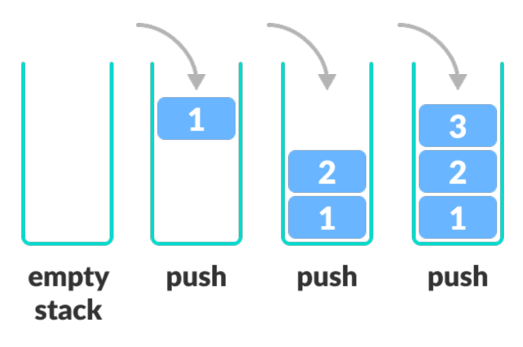
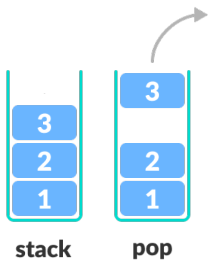

# Stack

## 수달 덕분에 알게 된 Stack


* Last In First Out
* 물건을 쌓아올리듯 데이터를 쌓는 자료구조.

> [백준 10828번](https://www.acmicpc.net/problem/10828)
>
> [백준 10828번 깃](https://github.com/eastheat10/algorithm/blob/master/src/algo/etc/A10828.java)


### Stack 선언

```java
import java.util.Stack;

Stack<Integer> stack_int = new Stack<>();
Stack<String> stack_String = new Stack<>();
```


### Stack 값 추가

```java
Stack<Integer> stack = news Stack<>();		// int형 스택
stack.push(1);		// stack에 값 1 추가
stack.push(2);		// stack에 값 2 추가
stack.push(3);		// stack에 값 3 추가
```

* push() 라는 메소드를 사용해서 스택에 값 추가.
* 나중에 들어온 데이터가 맨 위에 쌓임.




### Stack 값 삭제

```java
Stack<Integer> stack = news Stack<>();		// int형 스택
stack.push(1);		// stack에 값 1 추가
stack.push(2);		// stack에 값 2 추가
stack.push(3);		// stack에 값 3 추가
stack.pop();		// stack에 값 제거
stack.clear();		// stack 초기화
```

* pop()메소드를 사용해서 스택의 값을 제거할 수 있다.
* clear()메소드를 사용해서 스택의 값을 모두 제거할 수 있다.




### Stack 가장 상단의 값 출력

```java
Stack<Integer> stack = news Stack<>();		// int형 스택
stack.push(1);		// stack에 값 1 추가
stack.push(2);		// stack에 값 2 추가
stack.push(3);		// stack에 값 3 추가
stack.peek();		// stack의 가장 상단의 값 출력
```

* 스택의 가장 위에 있는 값(가장 나중에 입력된 값)을 출력할 때 peek()메소드 이용할 수 있다.

  

### Stack 기타 메소드

```java
Stack<Integer> stack = new Stack<>(); 	//int형 스택 선언
stack.push(1);		// stack에 값 1 추가
stack.push(2);		// stack에 값 2 추가
stack.size();		// stack의 크기 출력 : 2
stack.empty();		// stack이 비어있는제 check (비어있다면 true)
stack.contains(1);		// stack에 1이 있는지 check (있다면 true)
```

* size(): 스택의 크기

* empty(): 비어있으면 **true**, 값이 있으면 **false**

* contains(value): stack의 값 search

  


