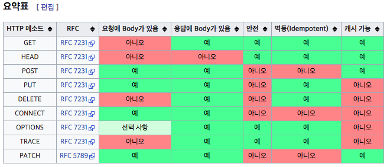

# HTTP 웹 기본 지식
> 참고: [모든 개발자를 위한 HTTP 웹 기본 지식 - 인프런 | 강의](https://www.inflearn.com/course/http-%EC%9B%B9-%EB%84%A4%ED%8A%B8%EC%9B%8C%ED%81%AC)  

# 인터넷 네트워크
## IP 프로토콜
* IP 주소 (인터넷 프로토콜)
	* 지정한 IP주소에 데이터 전달
	* 패킷이라는 통신 단위로 데이터 전달
	* IP패킷 정보
		* 출발지 IP, 목적지 IP, 기타
		* 전송 데이터

	* IP 프로토콜의 한계
		* 비연결성
			* 패킷을 받을 대상이 없거나 서비스 불능 상태여도 패킷 전송
		* 비신뢰성
			* 중간에 패킷이 사라지면?
			* 패킷이 순서대로 안오면?
		* 프로그램 구분
			* 같은 IP를 사용하는 서버에서 통신하는 애플리케이션이 둘 이상이면?
	
* 인터넷 프로토콜 스택의 4계층
	1. 애플리케이션 계층 - HTTP, FTP
	2. 전송계층 - TCP, UDP
	3. 인터넷 계층 - IP
	4. 네트워크 인터페이스 계층
> 1. 프로그램이 메세지 생성 (프로그램 -> 애플리케이션 계층)  
> 2. 소켓 라이브러리를 통해 전달 (애플리케이션 계층 -> TCP)  
> 3. TCP 정보 생성, 메세지 데이터 포함 (TCP -> IP)  
> 4. IP 패킷 생성, TCP 데이터 포함  (IP -> LAN)  

## TCP
* TCP/IP 패킷 정보
	* IP 패킷 내부에 존재
	* 출발지 포트, 목적지 포트, 전송제어, 순서, 검증정보 … 
* TCP 특징 (전송 제어 프로토콜)
	* 연결지향 - TCP 3 way handshake(가상 연결)
		* 연결과정(connect)
		1. syn (접속 요청 || 클라이언트 -> 서버)
		2. syn + ack (요청 수락 || 서버 -> 클라이언트)
		3. ack (클라이언트 -> 서버)
		4. 데이터 전송
	* 데이터 전달 보증
		1. 데이터 전송 (클라이언트 -> 서버)
		2. 데이터 잘 받았음 (서버 -> 클라이언트)
	* 순서보장
		1. 패킷1, 패킷2, 패킷3 순서로 전송
		2. 패킷1, 패킷3, 패킷2 순서로 도착
		3. 패킷2부터 다시보내
	* 신뢰할 수 있는 프로토콜
	* 현재는 대부분 TCP 사용

## UDP
* UDP 특징
> 사용자 데이터크램 프로토콜  
	* 기능이 거의 없음
	* 연결지향 - 3 way handshake X
		* 시간이 많이 걸리고 데이터 양도 많음
	* 데이터 전달보증 X
	* 순서보장 X
	* 데이터 전달 및 순서가 보장되지 않지만 단순하고 빠름
	* 정리
		* IP와 거의 같다 + 포트 + 체크섬 정도 추가
		* 애플리케이션에서 추가 작업 필요

## PORT
> 같은 IP 내에서 프로세스 구분  

* IP : 목적지 서버를 찾는 것 (아파트)
* PORT: 서버 안에서 작동하는 애플리케이션을 구분하는 것 (동호수)
* 0 ~ 65535 할당 가능
* 0 ~ 1023: 잘 알려진 포트, 사용하지 않는 것이 좋음
	* FTP  - 20, 21
	* TELNET - 23
	* HTTP - 80
	* HTTPS - 443

## DNS (Domain Name System)
> IP를 잊어버리기 쉽다.  
> IP가 변경될 수 있다.  
* 도메인 구매 후 IP 에 해당 도메인 할당

# URI 와 웹 브라우저 요청 흐름
​			

## URI (Uniform Resource Identifier)
* Uniform: 리소르를 식별하는 통일된 방식
* Resource: 자원, URI로 식별할 수 있는 모든 것 (제한 없음)
* Identifier: 다른 항목과 구분하는데 필요한 정보

1. URL (locator)
	* 리소스의 위치를 지정
2. URN (name)
	 * 리소스에 이름을 부여

* 위치는 변할 수 있지만, 이름은 변하지 않는다.
* URN 이름만으로 실제 리소스를 찾을 수 있는 방법이 보편화 되지 않음
* 문법
	* schema://[userinfo@]host[:port][/path][?query][\#fragment]
	* https://www.google.com:443/search?q=hello&hl=ko

	* 프로토콜(https)
	* 호스트명(www.google.com)
	* 포트번호(443)
	* 패스(/search)
	* 쿼리 파라미터(q=hello&hl=ko)
	
* schema
	* 주로 프로토콜 사용
	* 프로토콜 : 어떤 방식으로 자원에 접근할 것인가 하는 약속
		* ex) http, https, ftp …
	* http는 80포트, https는 443포트를 주로 사용, 포트는 생략가능
	* https는 http에 보안 추가 (http Secure)
	
* userinfo
	* url에 사용자 정보를 포함해서 인증
	* 거의 사용하지 않음
	
* host
	* 호스트 명
	* 도메인 명 또는 IP주소를 직접 사용 가능
	
* PORT
	* 포트
	* 접속포트
	* 생략가능
	
* PATH
	* 리소스의 경로(path), 계층적 구조
	* ex) _home_file1.jpg || /members || /members/100 …
	
* QUERY 
	* key = value 형태
	* ? 로 시작, &로 추가 가능
	* 쿼리파라미터, 쿼리 스트링 등으로 불림, 웹서버에 제공하는 파라미터, 문자형태
	
* FRAGMENT
	* html 내부 북마크 등에 사용
	* 서버에 전송되는 데이터가 아니다.
		
		
# HTTP
* HTTP 특징
	1. 클라이언트 서버 구조
	2. 무상태 프로토콜(스테이리스), 비연결성
	3. HTTP 메세지
	4. 단순함, 확장 가능
	
* 클라이언트 서버 구조
	* Request Response 구조
	* 클라이언트는 서버에 요청을 보내고, 응답을 대기
	* 서버가 요청에 대한 결과를 만들어서 응답
	

## 무상태 프로토콜 (Stateless)
* 서버가 클라이언트의 상태를 보존하지 않음

* 장점: 서버의 확장성 증가 (스케일 아웃)
	
	* 응답 서버를 쉽게 바꿀 수 있다.
	
* 단점: 클라이언트가 추가 데이터 전송

* 무상태로 설계 할 수 있는 것 / 없는 것 있음

* 무상태
	
	* ex) 로그인이 필요없는 단순한 서비스 소개 화면
	
* 상태 유지
	
	* ex) 로그인
	
* 로그인 한 사용자의 경우 로그인 했다는 상태를 서버에 유지

* 일반적으로 브라우저 쿠키와 서버 세션 등을 사용해서 상태 유지

* 상태유지는 최소한만 사용
	
	​			
## 비 연결성
* **장점**
	* HTTP는 기본이 연결을 유지하지 않는 모델
	* 일반적으로 초 단위 이하의 빠른 속도로 응답
	* 1시간 동안 수천명이 서비스를 사용해도 실제 서버에서 동시에 처리하는 요청은 수십개 이하로 매우 작음
		* ex) 웹 브라우저에서 계속 연속해서 검색버튼을 누르지는 않는다.
	* 서버 자원을 매우 효율적으로 사용할 수 있음
* **단점**
	* TCP/IP 연결을 새로 맺어야 함 - 3 way handshake 시간 추가
	* 웹 브라우저로 사이트를 요청하면 HTML 뿐만 아니라 자바스크립트, css, 추가 이미지 등 수 많은 자원이 함께 다운로드
	* 지금은 HTTP 지속 연결(Persistence Connections) 로 문제 해결
	* HTTP/2, HTTP/3 에서 더 많은 최적화
	
	
## HTTP 메세지
* http 메세지
	* start line
		* request-line(요청) / status-line (응답)
		* request-line = **method** SP(공백) request-target SP HTTP-version CRLF(엔터)
		* http 메서드
			* 종류: GET, POST, PUT, DELETE
			* 서버가 수행해야 할 동작 지정
				* GET: 리소스 조회
				* POST: 요청 내역 처리
		* status-line = HTTP-version SP **status-code** SP reason-phrase CRLF
	* header
		* header-field = field-name “:” OWS field-value OWS (OWS: 띄어쓰기 허용)
		* field name은 대소문자 구분 없음
		* HTTP 전송에 필요한 모든 부가정보
			* ex) 메세지 바디의 내용, 메세지 바디의 크기, 압축, 인증, 요청 클라이언트(브라우저) 정보, 서버 애플리케이션 정보, 캐시 관리 정보…
		* 표준 헤더가 많음
		* 필요시 임의의 헤대 추가 가능
	* empty line (CRLF)
	* message body
		* 실제 전송할 데이터
		* HTML 문서, 이미지, 영상, JSON 등 byte로 표현할 수 있는 모든 데이터 전송가능
	
	
## HTTP 메서드
* GET
	* 리소스 조회
	* 서버에 전달하고 싶은 데이터는 쿼리를 통해서 전달
	* 메세지 바디를 사용해서 데이터를 전달할 수 잇지만, 지원하지 않는 곳이 많음.
* POST
	* 새 리소스 생성 (등록)
		* 서버가 아직 식별하지 않은 새 리소스 생성
	* 요청 데이터 처리
		* 단순히 데이터를 생성하거나, 변경하는 것을 넘어서 프로세스를 처리해야 하는 경우
			* ex) 주문에서 결제 완료 -> 배달시작 -> 배달완료 처럼 단순히 값 변경을 넘어 프로세스의 상태가 변경되는 경우
		* POST의 결과로 새로운 리소스가 생서되지 않을 수도 있음
			* ex) POST _orders_{orderId}/start-delivery (컨트롤 URI)
		* 다른 메서드로 처리하기 애매한 경우
	* **메세지 바디를 통해 서버로 요청 데이터 전달**
		* 메세지 바디를 통해 들어온 데이터를 처리하는 모든 기능을 수행한다
	* 주로 전달 된 데이터로 신규 리소스 등록, 프로 세스 처리에 사용
* PUT
	* 리소스를 대체
		* 리소스가 있으면 대체
		* 리소스가 없으면 생성
		* (덮어쓰기)
	* **클라이언트가 리소스를 식별**
		* 클라리언트가 리소스 위치를 알고 URI 지정
		* POST와 차이점
	* 원래 데이터가 { “name” : “kim”, “age”: 20 }
	* {“age”:50} 전송하면 name 필드 사라지고 {“age”:50} 만 남음
* PATCH
	* 리소스 부분변경
	* 원래 데이터가 { “name” : “kim”, “age”: 20 }
	* {“age”:50} 전송하면 { “name” : “kim”, “age”: 50}
* DELETE
	* 리소스 제거
		
## HTTP 메서드 속성 

> 출처: https://ko.wikipedia.org/wiki/HTTP  

* 안전 (Safe)
	* 호출해도 리소스를 변경되지 않는다. (GET)
	* 계속 호출해서 로그가 쌓이면? -> 그런 부분 고려x 해당 리소스만 고려한다.
* 멱등 (Idempotent)
	* f(f(x)) = f(x)
	* 한 번 호출하든 두 번 호출하든 100번 호출하든 같은 결과가 나온다.
	* 멱등 메서드
		* GET: 한 번 조회하든, 두 번 조회하든 같은 결과가 조회된다.
		* PUT: 결과를 대체한다. 같은 요청을 여러번 해도 최종 결과는 같다.
		* DELETE: 결과를 삭제한다. 같은 요청을 여러번 해도 삭제된 결과는 똑같다.
		* ::POST::: **멱등이 아니다** 두 번 호출하면 같은 결제가 중복해서 발생할 수 있다.
	* 활용
		* 자동 복구 매커니즘
		* 서버가 TIMEOUT 등으로 정상 응답을 못 주었을 때, 클라이언트가 같은 요청을 다시 해도 되는가? 판단근거
	* 외부 요인으로 중간에 리소스가 변경되는 것 까지는 고려하지 않는다.
* 캐시 가능 (cacheable)
	* 응답 결과 리소스를 캐시해서 사용해도 되는가?
	* GET, HEAD, POST, PATCH 캐시 가능
	* 실제로는 GET, HEAD 정도만 캐시로 사용
		* POST, PATCH는 본문 내용까지 캐시 키로 고려해야 하는데, 구현이 쉽지 않음
		
		
# HTTP 메서드 활용
## 클라이언트에서 서버로 데이터 전송
* 데이터 전달 방식
	* 쿼리 파라미터를 통한 데이터 전송
		* GET
		* 주로 정렬 필터 (검색어)
	* 메세지 바디를 통한 데이터 전송
		* POST, PUT, PATCH
		* 회원가입, 상품 주문, 리소스 등록, 리소스 변경
* 4가지 상황 예시
	* **정적 데이터 조회** (쿼리 파라미터 미사용)
		* 이미지, 정적 텍스트 문서
	* **동적 데이터 조회** (쿼리 파라미터 사용)
		* 주로 검색, 게시판 목록에서 정렬필터 (검색어)
		* 조회 조건을 줄여주는 필터, 조회 결과를 정렬하는 정렬 조건에 주로 사용
		* 조회는 GET 사용
		* GET은 쿼리 파라미터 사용해서 데이터 전달
	* **HTML Form을 통한 데이터 전송**
		* HTML From submit 시 POST 전송
			* 회원가입, 상품 주문, 데이터 변경
		* Content-Type: application/x-www-form-urlencoded 사용
			* form의 내용을 메세지 바디를 통해서 전송(key=value, 쿼리파라미터 형식)
			* 전송데이터를 url encoding 처리
				* ex) abc김 -> abc%EA%B9%80
		* HTML Form 은 GET 전송도 가능
		* Content-Type: multipart/form-data
			* 파일 업로드 같은 바이너리 데이터 전송 시 사용
			* 다른 종류의 여러 파일 폼과 폼의 내용 함께 전송 가능(그래서 이름이 multipart)
		* 참고: HTML Form 전송은 **GET, POST** 만 지원
	* **HTTP API를 통한 데이터 전송**
		* 회원가입, 상품주문, 데이터 변경
		* 서버 to 서버
			* 백엔드 시스템 통신
		* 앱 클라이언트  
			* 아이폰, 안드로이드
		*  웹 클라이언트
			* HTML에서 Form 전송 대신 자바 스크립트를 통한 통신에 사용(Ajax) 
			* ex) React, Vue 같은 웹 클라이언트와 API 통신
		* POST, PUT, PATCH: 메세지 바디를 통해 데이터 전송
		* GET: 조회, 쿼리 파라미터로 데이터 전달
		* Content-Type: application/json 을 주로 사용( 사실상 표준)
			* TEXT, XML, JSON 등등
				
## HTTP API 설계 예시
* 회원 관리 시스템
> API 설계 - POST 기반 등록  
	* 회원 목록 /members -> GET
 	* 회원 등록 /members -> POST
 	* 회원 조회 _members_{id} -> GET
 	* 회원 수정 _members_{id} -> PATCH, PUT, POST
 	* 회원 삭제 _members_{id} -> DELETE

	* POST - 신규 자원 등록 특징
		* 클라이언트는 등록될 리소스의 URI를 모른다.
			* 회원등록 /members -> POST
			* POST /members
		* 서버가 새로 등록된 리소스 URI를 생성해준다.
			* HTTP/1.1 201 Create
			Location: /members/100
		* 컬렉션(Collection)
			* 서버가 관리하는 리소스 디렉토리
			* 서버가 리소스의 URI를 생성하고 관리
			* 여기서 컬렉션은 /members

* 파일 관리 시스템		
> API 설계 - PUT 기반 등록 (덮어쓰기)  
	* 파일 목록 /files -> GET
	* 파일 조회 _files_{filename} -> GET
	* 파일 등록 _files_{filename} -> PUT
	* 파일 삭제 /files /{filename}-> DELETE
	* 파일 대량 등록 /files -> POST

	* PUT - 신규 자원 등록 특징
		* 클라이언트는 등록될 리소스의 URI를 알고 있어야 한다.
			* 파일 등록 _files_{filename} -> PUT
			* PUT _files_star.jpg
		* 클라이언트가 직접 리소스 URI를 지정한다.
		* 스토어(Store)
			* 클라이언트가 관리하는 리소스 저장소
			* 클라이언트가 리소스의 URI를 알고 관리
			* 여기서 스토어는 /files

* HTML Form 사용
	* HTML Form은 GET, POST 만 지원
	* AJAX 같은 기술을 사용해서 해결 가능 -> 회원 API 참고
	* 여기서는 순수 HTML, HTML Form 이야기
	* 컨트롤 URI
		* GET, POST 만 지원하므로 제약이 있음
			* 회원 목록        /members -> GET
			* 회원 등록 폼    _members_new -> GET
			* 회원 등록        _members_new, /members -> POST
			* 회원 조회        _members_{id] -> GET
			* 회원 수정 폼    _members_{id]/edit -> GET
			* 회원 수정        _members_{id]_edit, /members_{id} -> POST
			* 회원 삭제        _members_{id}/delete -> POST
		* 이런 제약을 해결하기 위해 동사로 된 리소스 경로 사용
		* POST의 /new, /edit, /delete가 컨트롤 URI
		* HTTP 메서드로 해결하기 애매한 경우 사용(HTTP API 포함)
			
## 참고하면 좋은 URI 설계 개념
	* 문서 (document)
		* 단일 개념 (파일 하나, 객체 인스턴스, 데이터베이스 row)
		* ex) _members/100, /files_star.jpg
	* 컬렉션 (collection)
		* 서버가 관리하는 리소스 디렉터리
		* 서버가 리소스의 URI를 생성하고 관리
		* ex) /members
	* 스토어 (store)
		* 클라이언트가 관리하는 자원 저장소
		* 클라이언트가 리소스의 URI를 알고 관리
		* ex) /files
	* 컨트롤러 (controller), 컨트롤 URI
		* 문서, 컬렉션, 스토어로 해결하기 어려운 추가 프로세스 실행
		* 동사를 사용
		* ex) _members_{id}/delete

> 참고할만한 사이트 : https://restfulapi.net/resource-naming  

​		
# HTTP 상태코드
## 상태코드
> 클라이언트가 보낸 요청의 처리 상태를 응답에서 알려주는 기능   
1. _**1xx (Informational)**_: 요청이 수신되어 처리 중 (잘 사용하지 않음) 
2. _**2xx (Successful)**_: 요청 정상 처리 
	* ::200 OK::
		* 요청 성공
	* ::201 Created::
		* 요청 성공해서 새로운 리소스가 생성됨 (**POST**)
		* 생성된 리소스는 응답의 Location 헤더 필드로 식별
	* ::202 Accepted (잘 사용 되지 않음)::
		* 요청이 접수되었으나 처리가 완료되지 않았음
			* 배치 처리 같은 곳에서 사용
			* ex) 요청 접수 후 1 시간 뒤에 배치 프로세스가 요청을 처리함
	* ::204 No Content::
		* 서버가 요청을 성공적으로 수행했지만, 응답 페이로드 본문에 보낼 데이터가 없음
			* ex) 웹 문서 편집기에서 save 버튼
			* save 버튼의 결과로 아무 내용이 없어도 된다
			* save 버튼을 눌어도 같은 화면을 유지해야 한다.
			* 결과 내용이 없어도 204 메세지(2xx)만으로 성공을 인식할 수 있다
3. _**3xx (Redirection)**_: 요청을 완료하기 위해 유저 에이전트(웹 브라우저)의 추가 조치 필요
	* 리다이렉션: 웹 브라우저는 3xx 응답의 결과에 Location 헤더가 있으면 Location 위치로 자동 이동 (리다이렉트)
> url이 변경되었을 때 기존 url에서 301 코드를 반환하여 새로운 url로 자동 리다이렉트  
> * 리다이렉션 종류
> 	* 영구 리다이렉션 - 특정R리소스의 URI가 영구적으로 이동
> 		* ex) /members -> /users
> 		* ex) /event -> /new-event
> 	* 일시 리다이렉션 - 일시적인 변경
> 		* 주문 완료 후 주문 내역 화면으로 이동
> 		* PRG 패턴: Post_Redirect_Get
> 			* POST로 주문 후 웹브라우저 새로고침으로 인한 중복 주문 방지
> 			* POST로 주문 후에 주면 결과 화면을 GET 메서드로 리다이렉트
> 			* 새로고침해도 결과 화면을 GET으로 조회
> 			* 중복 주문 대신에 결과 화면만 GET으로 다시 요청
> 	* 특수 리다이렉션
> 		* 결과 대신 캐시를 사용
> * ::300 Multiple Choices (거의 안씀)::
> * _영구 리다이렉션_
> 	* 리소스의 URI가 영구적으로 이동
> 	* 원래의 URL을 사용하지 않음, 검색 엔진 등에서도 변경 인지
> 	* ::301 Moved Permanently::
> 		* 리다이렉트시 요청 메서드가 GET으로 변하고, 본문이 제거될 수 있음(MAY)
>  	* ::308 Permanent Redirect::
> 		* 301과 기능은 같음
> 		* 리다이렉트시 요청 메서드와 본문 유지 (처음 POST를 보내면 리다이렉트도 유지)
> * _일시적인 리다이렉션_
> 	* 리소스의 URI가 일시적으로 변경
> 	* 검색 엔진 등에서 URL을 변경하면 안됨
> 	* ::302 Found::
> 		* 리다이렉트시 요청 메서드가 GET으로 변하고, 본문이 제거될 수 있음(MAY)
> 	* ::303 See Other::
> 		* 302와 기능은 같음
> 		* 리다이렉트시 요청 메서드가 GET으로 변경
> 	* ::307 Temporart Redirect::
> 		* 302와 기능은 같음
> 		* 리다이렉트시 요청 메서드와 본문 유지 (요청 메서드를 변경하면 안된다. **MUST NOT**)
> 	* **무엇을 써야 하나?**
> 		* 정리
> 			* 302 Found -> GET으로 변할 수 있음
> 			* 307 Temporary Redirect -> 메서드가 변하면 안됨
> 			* 303 See Other -> 메서드가 GET으로 변경
> 		* 역사
> 			* 처음 302 스펙의 의도는 HTTP 메서드를 유지하는 것
> 			* 그런데 웹 브라우저들이 대부분 GET으로 바꾸어버림 (일부는 다르게 동작)
> 			* 모호한 302를 대신하는 명확한 303 ,307이 등장 (301 대응으로 308도 등장)
> 		* 현실
> 			* 307, 303을 권장하지만 현실적으로 이미 많은 애플리케이션 라이브러리들이 302를 기본값으로 사용
> 			* 자동 리다이렉션 시에 GET으로 변해도 되면 그냥 302를 사용해도 문제 없음
> * 기타 리다이렉션
> 	* 300 Multiple Choices: 안쓴다
> 	* ::304 Not Modified::
> 		* 캐시를 목적으로 사용
> 		* 클라리언트에게 리소스가 수정되지 않았음을 알려준다.
> 		* 따라서 클라이언트는 로콜 PC에 저장된 캐시를 재사용한다 (캐시로 리다이렉트 한다.)
> 		* 304 응답은 응답에 메세지 바디를 포함하면 안된다. (로컬 캐시를 사용해야 하므로)
> 		* 조건부 GET, HEAD 요청시 사용

4. _**4xx (Client Error)**_: 클라이언트 오류, 잘못된 문법 등으로 서버가 요청을 수행할 수 없음 
	* 오류의 원인이 클라이언트에 있음
	* 클라이언트가 이미 잘못된 요청, 데이터를 보내고 있기 때문에 **똑같은 재시도가 실패함** 
	* ::400 Bad Request::
		* 클라이언트가 잘못된 요청을 해서 서버가 요청을 처리할 수 없음
		* 클라이언트가 요청 내용을 다시 검토 후 전송해야 함
		* ex) 요청 파라미터가 잘못, API 스펙이 맞지 않을 때
	* ::401 Unauthorized::
		* 클라이언트가 해당 리소스에 대한 인증이 필요함
		* 인증(Authentication) 되지 않음
		* 301 오류 발생 시 응답에 WWW-Authenticate 헤더와 함께 인증 방법을 설명
		* 참고
			* 인증 (Authentication): 본인이 누구인지 확인, (로그인)
			* 인가 (Authorization): 권한부여 (ADMIN 권한처럼 특정 리소스에 접근할 수 있는 권한, 인증이 있어야인가가 있음
			* 오류 메세지가 Unauthorized 이지만 인증이 되지 않음 (이름이 아쉬움)
	* ::403 Forbiden::
		* 서버가 요청을 이해했지만 승인을 거부함
		* 주로 인증 자격 증명은 있지만, 접근 권한이 불충분한 경우
		* ex) ADMIN 등급이 아닌 사용자가 로그인은 했지만, ADMIN 등급의 리소스에 접근하는 경우
	* ::404 Not Found::
		* 요청 리소스가 서버에 없음
		* 또는 클라이언트가 권한이 부족한 리소스에 접근할 때 해당 리소스를 숨기고 싶을 때
5. _**5xx (Server Error)**_: 서버 오류, 서버가 정상 요청을 처리하지 못함 
	* 서버 문제로 오류 발생 (서버의 큰 오류가 생길 때만 발생시켜야 함)
	* 서버에 문제가 있기 때문에 재시도하면 성공할 수도 있음 (복귀가 되거나 등등)
	* ::500 Internal Server Error::
		* 서버 문제로 오류 발생
		* 애매하면 500 오류
	* ::503 Service Unavailable::
		* 서비스 이용 불가
		* 서버가 일시적인 과부하 또는 예정된 작업으로 잠시 요청을 처리할 수 없음
		* Retry-After 헤더 필드로 얼마 뒤에 복구되는지 보낼 수도 있음

# HTTP 헤더 - 일반헤더
## HTTP 헤더
* header-filed = field “:” OWS field-value OWS (OWS : 띄어쓰기 허용)
* field name 은 대소문자 구분 없음
* 용도
	* HTTP 전송에 필요한 모든 부가정보
	* ex) 메세지 바디의 내용, 메세지 바디의 크기, 압축, 인증, 요청 클라이언트, 서버정보, 캐시관리정보 …
	* 표준 헤더가 많음
	* 필요시 임의의 헤더 추가 가능
		
## HTTP 바디
* RFC723x(0~5) (HTTP 표준)
	* 엔티티(Entity) -> 표현(Representation)
	* Representation = representation Metadata _ Representation Data
	* 표현 = 표현 메타데이터 + 표현 데이터
* 메세지 본문을 통해 표현 데이터 전달
* 메세비 본문 = 페이로드 (payload)
* **표현**은 요청이나 응답에서 전달할 _실제 데이터_
* **표현 헤더는 표현데이터**를 해석할 수 있는 정보 제공
	* 데이터 유형(html, json), 데이터 길이, 압축정보 등등
> 참고: 표현 헤더는 표현 메타데이터와, 페이로드 메세지를 구분해야 하지만,   

## 표현
* Content-Type: 표현 데이터의 형식
	* 미디어 탑입, 문자 인코딩
	* ex)
		* text/html; charset-utf-8
		* application/json
		* image/png
* Content-Encoding: 표현 데이터의압축 방식
	* 표현 데이터를 압축하기 위해서 사용
	* 데이터를 전달하는 곳에서 압축 후 인코딩 헤더 추가
	* 데이터를 읽는 쪽에서 인코딩 헤더의 정보로 압축 해제
		* ex) 
			* gzip
			* deflate
			* identity
* Content-Language: 표현 데이터의 자연 언어
	* 표현 데이터의 자연언어를 표현
	* ex)
		* ko
		* en
		* en - US
* Content-Length: 표현 데이터의 길이
	* 바이트 단위
	* Transefer-Encoding(전송 코딩)을 사용하면 Content-Length를 사용하면 안됨
* 표현 헤더는 전송, 응답 둘 다 사용
		
## 협상 (Content Negotiation)
* Accept: 클라이언트가 선호하는 미디어 타입 전달
* Accept-Charset:클라이언트가 선호하는 문자 인코딩
* Accept-Encoding: 클라이언트가 선호하는 압축 인코딩
* Accept-Language: 클라이언트가 선호하는 자연언어
* 협상 헤더는 요청시에만 사용
	
### 우선순위
* Quality Value(q) 값 사용
* 0~1 클수록 높은 우선순위
	* Accept-Language: ko-KR, ko;q=0.9,en-US;q=0.8,en;q=0.7
		1. ko-KR;q=1 (q 생략)
		2. ko;q=0.9
		3. en-US;q=0.8
		4. en;q=0.7
* 구체적인 것이 우선한다.
* Accept: text**_, text_plain, text_plain;format=flowed, *_**
	1. text/plain;format=flowed
	2. text/plain
	3. text/*
	4. &#42; \ &#42;

## 전송 방식
* 단순 전송
	* Content-Length에 맞춰 요청을 하면 응답
* 압축 전송
	* Content-Encoding 속성을 포함해야한다.
* 분할 전송
	* Content-Length를 포함하면 안된다.
* 범위 전송
	* 예를 들어 이미지를 전송 받다 중단되면 중단된 이후의 내용부터 전송받을 수 있다.
			
## 일반정보
* Form: 유저 에이전트의 이메일 정보
	* 일반적으로 잘 사용되지 않음
	* 검색엔진 같은 곳에서 주로 사용
	* 요청에서 사용
* Beferer: 이전 웹페이지 주소
	* 현재 요청된 페이지의 이전 웹 페이지 주소
	* A -> B로 이동하는 경우 B를 요청할 때 Referer: A 를 포함해서 요청
	* Referer를 사용해서 유입경로 분석가능
	* 요청에서 사용
	* referer 는 referrer의 오타임
* User-Agent: 유저 에이전트의 애플리케이션 정보
	* Mozilla/5.0 (Macintosh; Intel Mac OS X 10_15_7) AppleWebKit/537.36 (KHTML, like Gecko) Chrome/89.0.4389.82 Safari/537.36
	* 클라이언트의 애플리케이션 정보(웹 브라우저 정보, 등등)
	* 통계 정보
	* 어떤 종류의 브라우저에서 장애가 발생하는지 파악 가능
	* 요청에서 사용
* Server: 요청을 처리하는 ORIGIN 서버의 소프트웨어 정보
	* Server: Apache/2.2.22 (Debian)
	* server: nginx
	* 응답에서 사용
* Date: 메세지가 발생한 날짜와 시간
	* Date: Tue, 15 Nov 1994 08:12:31 GMT
	* 응답에서 사용
		
## 특별한 정보
* Host: 요청함 호스트 정보 (도메인)
	* 요청에서 사용
	* **필수**
	* 하나의 서버가 여러 도메인을 처리해야 할 때
	* 하나의 IP 주소에 여러 도메인이 적용되어 있을 때
* Location
	1. 웹 브라우저는 3xx 응답의 결과에 Location 헤더가 있으면 Location 위치로 자동 이동 (리다이렉트)
	2. 응답코드 3xx에서 설명
	3. 201 (Create): Location값은 요청을 자동으로 리디렉션 하기 위한 대상 리소스를 가리킹
* Allow: 허용가능한 HTTP 메서드
	* 405 (Method Not Allowed) 에서 응답에 포함해야 함
	* Allow: GET, HEAD, PUT 
* Retry-After: 유저 에이전트가 다음 요청을 하기까지 기다려야 하는 시간
	* 503 (Service Unavailable): 서비스가 언제까지 불능인지 알려줄 수 있음
	* Retry-After: Fri, 31 Dec 1999 23:59:59 DMT (날짜 표기)
	* Retry-After: 120 (초단위 표기)
			
## 인증
* Authorization: 클라이언트 인증 정보를 서버에 전당
	* Authorization: Basic xxxxxxxxxxxxxxx
* WWW-Authenticate: 리소스 접근 시 필요한 인증 방법 정의
	* 리소스 접근시 필요한 인증 방법 정의
	* 401 Unauthorized 응답과 함께 사용
	* WWW-Authenticate: Newauth realm=“apps”, type=1,
						title=“Login to \”apps\””,Basic realm=“simple”
		
## 쿠키
* Set-Cookie: 서버에서 클라이언트로 쿠키 전달 (응답)   
* Cookie: 클라이언트가 서버에서 받은 쿠키를 저장하고 HTTP 요청 시 서버로 전달
* 사용처
	* 사용자 로그인 세션관리
	* 광고 정보 트래킹
* 쿠키 정보는 항상 서버에 전송됨
	* 네트워크 트래픽 추가 유발
	* 최소한의 정보만 사용 (세션 id, 인증 토큰)
	* 서버에 전송하지 않고, 웹 브라우저 내부에 데이터를 저장하고 싶으면 웹 스토리지 (localStorage, sessionStorage) 참고
* 주의할 점
	* 보안에 민감한 데이터는 저장하면 안됨 (주민번호, 카드번호 등등)
	
### 생명주기
* Set-Cookie: expires=Sat, 26-Dec-2020 04:39:21 GMT
	* 만료일이 되면 쿠키 삭제
* Set-Cookie: max-age=3600 (3600초)
	* 0이나 음수를 지정하면 쿠키 삭제
* 세션쿠키: 만료 날짜를 생략하면 브라우저 종료시 까지만 유지
* 영속쿠키: 만료 날짜를 입력하면 해당 날짜까지 유지
	
### 도메인
* ex) domain=example.org
* 명시: 명시한 문서 기준 도메인 + 서브 도메인 포함
	* domain=example.org를 지정해서 쿠키 생성
		* example.org 는 물론이고 dev.example.org도 쿠키 접근
* 생략: 현재 문서 기준 도메인만 적용
	* example.org 에서 쿠키를 생성하고 domain 지정을 생략
		* example.org 에서만 쿠키 접근
		* dev.example.org 에서만 쿠키 미접근
		
### 경로
* ex) path=/home
* 이 경로를 포함한 하위 경로 페이지만 쿠키 접근
* 일반적으로 path=/ 루트로 지정
* ex)
	* **path=/home 지정**
	* /home -> 가능
	* _home_level1 -> 가능
	* _home_level1/level2 -> 가능
	* /hello -> 불가능
	
### 보안
* Secure
	* 쿠키는 http, https 를 구분하지 않고 전송
	* Secure를 적용하면 **https**인 경우에만 전송
* HttpOnly
	* XSS 공격 방지
	* 자바스크립트에서 접근 불가 (document.cookie)
	* HTTP 전송에만 사용
* SameSite
	* XSRF 공격 방지
	* 요청 도메인과 쿠키에 설정된 도메인이 같은 경우만 쿠키 전송
		
		
# HTTP 헤더 - 캐시와 조건부 요청
## 캐시 기본 동작
* 캐시가 없을 때
	* 데이터가 변경되지 않아도 계속 네트워크를 통해서 데이터를 다운로드 받아야 한다.
	* 인터넷 네트워크는 느리고 비싸다.
	* 브라우저 로딩속도가 느리다.
	* 느린 사용자 경험
* 캐시적용
	* 캐시 덕분에 캐시 가능 시간동안 네트워크를 사용하지 않아도 된다.
	* 비싼 네트워크 사용량을 줄일 수 있다.
	* 브라우저 로딩속도가 매우 빠르다.
	* 빠른 사용자 경험
* 캐시 시간 초과
	* 캐시 유효 시간이 초과하면, 서버를 통해 데이터를 다시 조회하고 캐시를 갱신한다.
	* 이때 다시 네트워크 다운로드가 발생한다.
		
## 검증 헤더와 조건부 요청1
* 캐시 시간 초과
	* 캐시 유효시간이 초과해서 서버에 다시 요청하면 다음 두 가지 상황이 나타난다.
		1. 서버에서 기존 데이터를 변경함 (A -> B)
		2. 서버에서 기존 데이터를 변경하지 않음  (A -> A)
			* 데이터를 전송하는 대신에 저장해 두었던 캐시를 재사용할 수 있다.
			* 클라이언트 데이터와 서버 데이터가 같다는 사실을 확인해야 함. 
* 캐시 유효시간이 초과해도 서버의 데이터가 갱신되지 않으면 304 Not Modified + 헤더 메타정보만 응답 (바디 전송 x)
* 클라이언트는 서버가 보낸 응답 헤더 정보로 캐시의 메타 정보를 갱신
* 클라이언트는 캐시에 저장되어 있는 데이터 재활용
* 결과적으로 네트워크 다운로드가 적은 용량으로 발생
		
## 검증 헤더와 조건부 요청2
* 검증 헤더
	* 캐시 데이터와 서버 데이터가 같은지 검증하는 데이터
	* Last-Modified, ETag
* 조건부 요청 헤더
	* 검증 헤더로 조건에 따른 분기
	* If-Modified-Since: Last-Modified 사용
		* 데이터 미변경
			* 캐시: 2020.11.10 10:00:00 || 서버: 2020.11.10 10:00:00
			* 304 Not Modified, 헤더 데이터 전송 (Body 미포함)
			* 전송용량 적음
		* 데이터 변경
			* 캐시: 2020.11.10 10:00:00 || 서버: 2020.11.10 **11**:00:00
			* 200 OK, Body 포함 모든 데이터 전송
			* 전송용량 증가
		* 단점
			* 1초 미만 단위로 캐시 조정 불가
			* 날짜 기반의 로직 사용
			* 데이터를 수정해서 날짜가 다르지만, 같은 데이터를 수정해서 데이터 결과가 똑같은 경우
			* 서버에서 별도의 캐시 로직을 관리하고 싶은 경우
				* 예) 스페이스나 주석처럼 크게 영향이 없는 변경에서 캐시를 유지하고 싶은 경우
	* If-None-Match: ETag 사용
		* Entity tag
		* 캐시용 데이터에 임의의 고유한 버전 이름을 달아둠
			* ex) ETag : “v1.0”, ETag : “a2jiodwjekjl3”
		* 데이터가 변경되면 이 이름을 바꿔서 변경함 (Hash를 다시 생성함)
			* ex) ETag: “aaaaa” -> ETag: “bbbbb”
		* ETag 만 보내서 같으면 유지, 다르면 다시 받기
		* **캐시 제어 로직을 서버에서 완전히 관리**
		* 클라이언트는 단순히 이 값을 서버에 제공 (클라이언트는 캐시 매커니즘을 모름)
		* ex)
			* 서버는 베타 오픈 기간인 3일 동안 파일이 변경되어도 ETag를 동일하게 유지
			* 애플리케이션 배포 주기에 맞추어 ETag 모두 갱신
	* 조건이 만족하면 200 OK
	* 조건이 만족하지 않으면 304 Not Modified

## 캐시 제어 헤더
* Cache-Control: 캐시 지시어 (directives)
	* Cache-Control: max-age
		* 캐시 유효 시간, 초단위
	* Cache-Control: no-cache
		* 데이터는 캐시해도 되지만, 항상 origin 서버에 검증하고 사용
	* Cache-Control: no-store
		* 데이터에 민감한 정보가 있으므로 저장하면 안됨 (메모리에서 사용하고 최대한 빨리 삭제)
	* Cache-Control: public
		* 응답이 public 캐시에 저장되어도 됨
	* Cache-Control:private
		* 응답이 해당 사용자만을 위한 것임.
		* private 캐시에 저장해야 함 (기본값)
	* Cache-Control: s-maxage
		* 프록시 캐시에만 적용되는 max-age
	* Age: 60 (HTTP 헤더)
		* 오리진 서버에서 응답 후 프록시 캐시 내에 머문 시간 (초)

## 캐시 무효화
* Cache-Control: no-cache, no-store, must-revalidate
	* 확실한 캐시 무효화
	* Cache-Control: no-cache
		* 데이터는 캐시해도 되지만, 항상 origin 서버에 검증하고 사용
		* _프록시 서버에서 origin 서버 접근 불가 시 200 ok 보냄_
	* Cache-Control: no-store
		* 데이터에 민감한 정보가 있으므로 저장하면 안됨 (메모리에서 사용하고 최대한 빨리 삭제)
	* Cache-Control: must-revalidate
		* 캐시 만료 후 최초 조회시 원 서버에 검증해야함
		* _원 서버 접근 실패시 반드시 오류가 발생해야함 - 504(Gateway Timeout)_
		* must-revalidate 는 캐시 유효 시간이라면 캐시를 사용함
* Pragma: no-cache
	* HTTP 1.0 하위 호환

